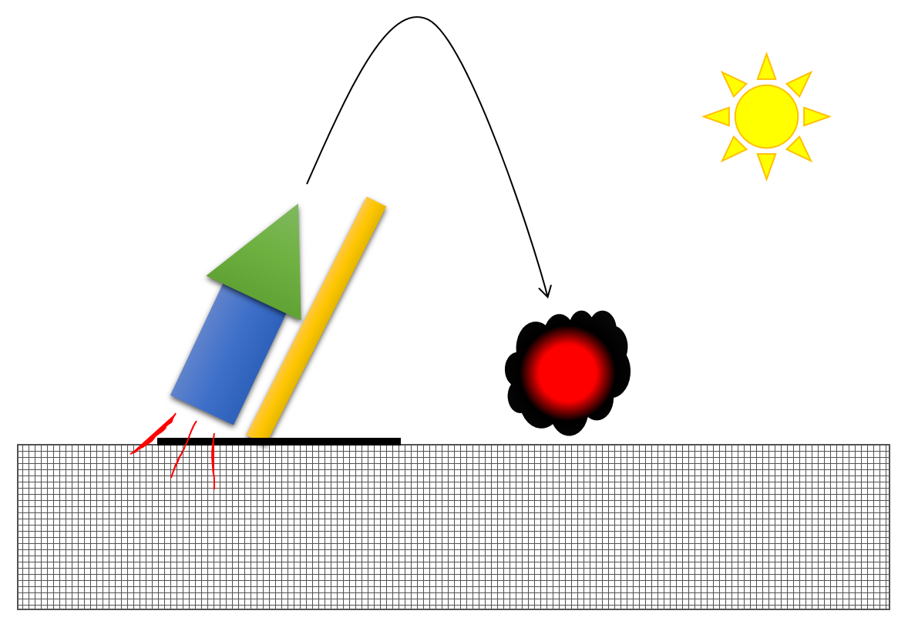

# 700120-2223-lab-final

This final lab exercise forms a substantive part of the assessment for both 700106 Real-Time Graphics and 700120 C++ Programming and Design.

## Concept

The exercise is to simulate the test firing of a rocket and the subsequent explosive and deformation that occurs when the rocket impacts the ground surface (the terrain).

This is not intended as a realistic simulation.  We're looking for a large rocket that only reaches an altitude of approx. 2-3 times its height, before returning to earth.

The idea is to keep everything large, slow and smooth, so that all graphical effects are easily visible.

## Mandatory Features

These features, when perfectly implemented, will provide approx 60% of the final mark. In addition, the list of features are a guide to the building blocks and functionality expected of the simultion.

### Terrain

The terrain is to be represented as a cuboid, made-up from a very large number of voxels.  
Each voxel is a small textured cube.

### Rocket

The rocket body consists of a body (cylinder) and nose (cone).
The surface details of the body of the rocket depend on the view positions:  a textured surface detail for a relatively distant view and a bumpy surface detailed for a close-up view. (advanced feature)
The nose of the rocket is shiny textured surface (chrome metallic surface – advanced)

### Launcher

The shape of the launcher (or stick) is a simple textured cylinder, which can be transformed into a much complex form with displacement mapping  (advanced feature)

### Animation

The rocket is to be launched into the air, following a basic projectile trajectory.  The rocket engine will stop and the rocket will fall back to the terrain.  There will be an explosion at the position where rocket impacts the terrain

### Rocket engine

The rocket engine, when ignited, is to be implemented as a particle system

### Explosion

The explosion is to be implemented as particle systems providing both smoke and fire effects
As a result of the explosion a number of the voxels at the impact point will be deleted, thereby creating a depression in the terrain surface.  Repeat firings of the rocket will gradually alter the appearance of the terrain. 

Once the rocket has exploded, a new rocket will spawn on the launcher
### Lighting

There are 4 light sources in this simulation:
1. Sun
2. Moon
3. Rocket engine particle system 
4. Explosion particle system

The sun and moon will move across the terrain simulating a day / night cycle.

### Shadows (advanced feature)

For the Sun and Moon light sources, the rocket and launcher should cast as well as receive shadows, which implies simple shadow mapping.

### Cameras

A numberof cameras are to be implemented, as follows:

- Camera 1:
Initially looking at the launcher
Adjustable via keyboard controls (see below)

- Camera 2:
Initially looking at the terrain surface
Adjustable via keyboard controls (see below)

- Camera 3:
Looking at the rocket
Tracking the rocket as it flies

- Camera 4:
A close up of the rockets nose 
Tracking the rocket nose as it flies

- Camera 5:
A close up of the rockets body 
Tracking the rocket body as it flies

### Controls

Note: the following key assignments are non-negotiable; they are expected to work in each submission to ease the demonstration process

- ‘ESC’ exits the application
- ‘r’ resets the application to its initial state
- Cameras are controlled by the cursor keys:
    - ‘left’/‘right’/’up’/’down’ rotate left/right/up/down, respectively
    - CTRL + ‘left’/‘right’/’up’/’down’/’page up’/’page down’ panning to left/right/forward/backward/up/down, respectively
    - Alternatively, w-a-s-d or i-j-k-l keys may be used instead of the “cursor” keys
- Function keys F1 to F5 will select cameras C1 to C5, respectively
- Function key F6 switched between render modes: wire frame, diffuse (non-textured), diffuse (textured), diffuse (textured) with displacement mapping, and toon/cel shading
- ‘<’ / ‘>’ to decrease/increase the pitch of the launcher.
- Function key F11, to launch the rocket.
- Keys 't'/'T' decrease/increase a factor that globally slows/speeds-up time-dependent effects

### Configuration File

Scene elements and their animations paths as well as lights and camera configurations are read from a configuration file.

## Optional/Advanced Features

Each advanced feature has an associated difficultly point. The maximum mark available for each feature is this difficulty point. Only 30 marks are available for implementing advanced features. These 30 marks can be gained either by perfectly implementing features worth 30 points, or by partially implementing features worth up to 40 points. Any features implemented beyond 40 points will not be marked. Marks for advanced features will be capped at 30.

### Shading

[4 points] bump mapping of geometry
[2 points*] displacement mapping of geometry [*builds on bump mapping]
[4 points] toon shading of geometry (e.g., toon/cel shading)
[4 points] environment cube mapping on all surfaces with a high specular component (e.g. on rocket nose)

### Advanced Shadows

[8 points] Shadow mapping
[4 points*] Advanced shadow mapping (e.g., PCF, VSM) [*builds on shadow mapping]

### Scene level rendering modes

[8 points] Deferred rendering, including the ability to switch the visualization for the various MRT buffers
[4 points] High-dynamic range rendering and tone-mapped post-processing

### UI

[4 points] Statistics and control elements using IMGUI; for the control elements this is in addition to the mandatory keyboard-navigation features.

## Hints

The following may help you to successfully complete your work:
- Produce a paper visualization (e.g., story-board sketches) of your project and check it with a member of the module team
- Produce a top-level software design and check it with a member of the module team.
- Prototype your ideas to help produce a more detailed design
- Test your software at each stage of development
- Document as you go

## Implementation

The final implementation must be able to run on a standard PC in the post-graduate graphics lab, i.e. FEN-177.
Only the following libraries and APIs are permitted:
- DirectX 11 SDK
- GLM or DirectMath 
- IMGUI (http://github.com/ocornut/imgui)
- AssImp (http://www.assimp.org/)

The use of any language feature within C++ 11, 14, 17 or 20 is permitted (assuming working compiler support; please remember the final product needs to run on a standard PC in FEN-177). 

The following libraries and APIs are NOT permitted:
- DirectX Toolkit
- Boost
- WinRT

Prior approval is required for any other APIs and features.
 
## Lab Book

You are required to add the following two entries to your Lab Book:

### Design (700120) – [word limit 1000]

- Class diagram(s) containing main classes
- Class diagram(s) containing service/utility classes
- A textual description giving the name, role and responsibilities of each class
- Interaction diagram(s) for significant components of the software design
- A critique of the design, including details on:
- The merits of the design?
- Weaknesses of the design?
- What has changed in the design?
- What would you do in a different way?

### Graphics (700106) – [word limit 1000]

- Document and critique the algorithms used, including:
- Geometry representation and processing
- Shading and lighting
- Shadow generation
- Particle system
- Explain how application objects and their graphics representation are connected; discuss the advantages/disadvantages of your approach
- Explain how application-object behavior is updated and how these updates are propagated to the graphics representation
- Discuss potential extensions (especially with respect to non-implemented items from the advanced feature list) as well as potential scalability issues
- What feature (not necessarily mentioned before) would you have liked to add?

## Video

A 3 to 5 minute video with audio commentary. The video should highlight each of the key elements of your implementation. It is strongly suggested that you work through the list of mandatory and optional features within the specification, showing each in turn.

## Demonstration

You will be required to both demonstrate your solution, and take part in a code review (RESIT only). The code review will consist of your examiners selecting parts of your code and requiring you to explain the implementation and the rationale behind the design.
